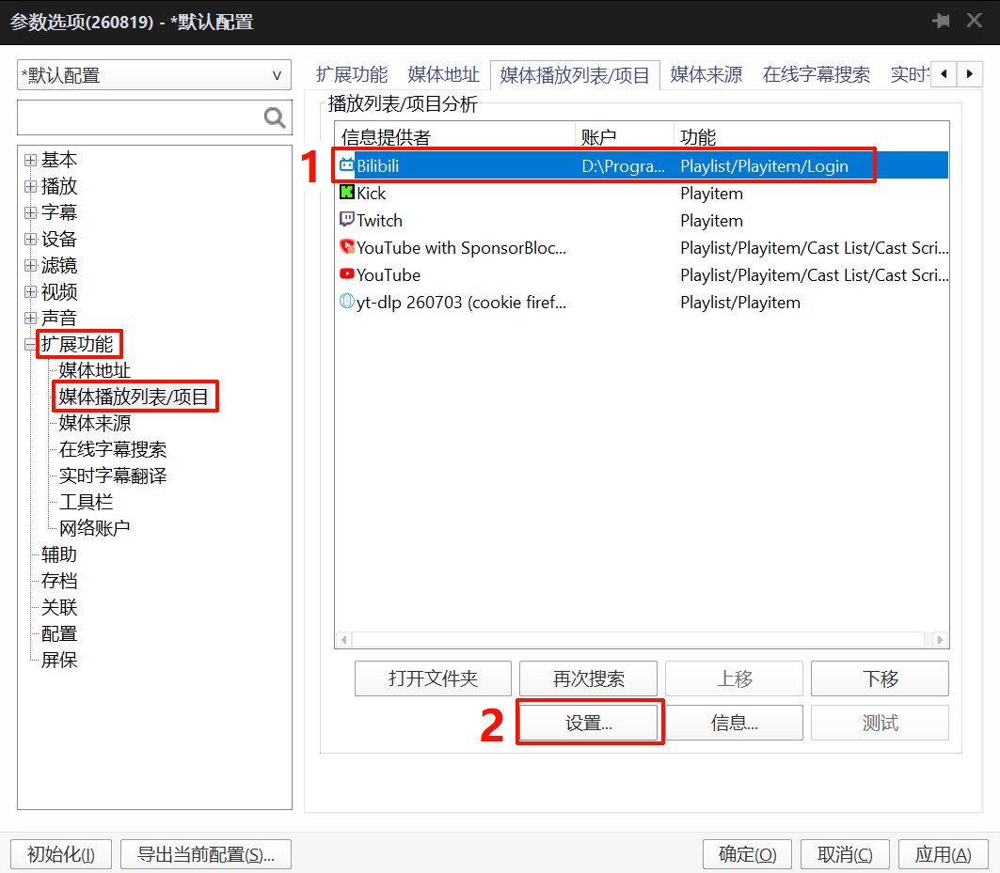

# BilibiliPotPlayer

本项目基于 [chen310/BilibiliPotPlayer](https://github.com/chen310/BilibiliPotPlayer) 及其上游版本 [juening2000/BilibiliPotPlayer](https://github.com/juening2000/BilibiliPotPlayer) 进行维护，并针对个人使用需求持续进行功能改进、Bug 修复和测试。

本项目主要用于持续测试、维护和提交改进。

如果上游项目恢复持续更新，本项目将优先向上游提交相关改进，并根据上游项目的维护情况决定是否继续维护本项目。


## ✨ 主要改进

### 🔐 直接网页登录，免手动配置 Cookie

相较于原版本[chen310/BilibiliPotPlayer](https://github.com/chen310/BilibiliPotPlayer) 和上游版本[juening2000/BilibiliPotPlayer](https://github.com/juening2000/BilibiliPotPlayer)，本项目对 Bilibili 登录方式进行了较大的改进：

- **无需手动获取、复制和配置 Cookie**
- 通过**网页登录**完成账号认证
- 登录流程更加直观，降低使用门槛
- 登录状态由程序自动处理
- 对普通用户更加友好

> 如果你不希望手动获取 Cookie，这是本项目与上游版本最明显的区别。

## 其它改进

### 🔧 整体优化
- 本地缓存响应数据，降低 API 请求次数。可在配置文件中设置，默认300s。
- 清理部分无用旧代码。

### 📺 直播

- 支持 AVC、HEVC、AV1
- 默认使用低延迟的 HLS/fMP4 流，无法提供时回退至 HLS/TS
- 支持直播备用地址
- 动态生成直播画质选项

### ▶️ 点播

- 支持屏蔽 P2PCDN，可通过配置文件调整，默认屏蔽
- 修复部分 Host 为 `upos` 的点播 URL 播放失败的问题
- Bilibili 点播更换新接口，尽量使用wbi签名认证防止接口失效
- 重新支持用户合集视频，并支持多合集，potplayer 播放列表( 快捷键 <kbd>F6</kbd> ) 正确显示合集视频。
  - 当存在用户视频合集时，播放列表里只展示合集视频。
  - 当只存在单个视频时，播放列表里包含当前视频与推荐视频（是否包含推荐视频取决于配置文件`showRecommendedVideos`开关）
- 播放番剧，电视剧等其它PGC合集或用户合集时，正确定位当前视频，不会出现从第一集开始播放的问题
- 支持AV播放地址
- 优化 Bilibili 音频画质选项显示：
  - `EC-3` → **杜比全景声 EC-3**
  - `FLAC` → **Hi-Res 无损 FLAC**
- 当同时存在 `杜比全景声` 与 `Hi-Res无损` 时，默认使用 `Hi-Res无损`。
- 视频与播放列表增加多项属性，如果你足够细心的话，就可以发现。
- 增加 [空降助手](https://github.com/hanydd/BilibiliSponsorBlock) 支持。通过配置文件设置，另外支持指定镜像站点，以解决主站访问不稳定的问题。（由于目前主站访问不稳定，镜像站是临时的，所以默认禁用。）

## TODO

* ~~支持精准空降（视 PotPlayer 是否提供相关支持）~~，目前搭配油猴脚本实现。
* ~~支持空降助手~~。

## 一些可能的问题及解决办法

### 播放视频时一直转圈，右下角画质选项不断跳动

这通常是由于 PotPlayer 中保存了旧的 `Cookie`、`Header` 或 `Referer` 信息导致的。可以尝试清理相关配置后重新播放。

#### 检查是否「保存设置到 INI 文件」
(按 F5 打开选项"设置 - 基本" 页面下)

* **如果未勾选「保存设置到 INI 文件」：** 

  1. 打开注册表编辑器（`regedit`）。

  2. 定位到： `计算机\HKEY_CURRENT_USER\Software\DAUM\`

  3. 根据你平时使用的 PotPlayer 程序，进入对应的注册表项：（一般情况下使用的是 `PotPlayerMini64`）
    * `PotPlayer64`
    * `PotPlayerMini64`

  4. 删除其中的以下键值（如果存在）：
    * `_UrlCookie`
    * `_UrlHeader`
    * `_UrlReferer`

* **如果已勾选「保存设置到 INI 文件」：**

  1. 打开 PotPlayer 安装目录。

  2. 根据你平时使用的程序，打开对应的配置文件：(一般情况下使用的是 `PotPlayerMini64.ini`。)
    * `PotPlayerMini64.ini`
    * `PotPlayer64.ini`

  3. 在文件中删除以下配置节（如果存在）：
    ```ini
        [_UrlCookie]
        [_UrlHeader]
        [_UrlReferer]
    ```

完成后重新启动 PotPlayer，再尝试播放。

## 油猴脚本

由于从 PotPlayer 内部实现精准空降存在一定难度<sup>[1](#关于精准空降)</sup>，因此目前采用外部油猴脚本的方式实现其功能。

目前修改版脚本 [BilibiliPotPlayer-改](https://greasyfork.org/zh-CN/scripts/593353-bilibilipotplayer-改) 支持：

* **精准空降**：将网页端指定的播放时间传递给 PotPlayer，实现精准跳转。

* **打开 PotPlayer 时自动暂停网页端视频**：启动 PotPlayer 播放后，自动暂停 Bilibili 网页端正在播放的视频，避免音视频重复播放。


### 声明

修改版脚本 `BilibiliPotPlayer-改` [https://greasyfork.org/zh-CN/scripts/593353-bilibilipotplayer-改](https://greasyfork.org/zh-CN/scripts/593353-bilibilipotplayer-%E6%94%B9)) 基于`原版油猴脚本` [油猴脚本https://greasyfork.org/zh-CN/scripts/461800-bilibilipotplayer](https://greasyfork.org/zh-CN/scripts/461800-bilibilipotplayer)，并保留原作者及原项目相关信息。如原作者对本脚本的发布或再分发存在异议，并要求停止发布，本人将配合下架本脚本。


## 安装插件

[下载项目](https://github.com/frostnotfall/BilibiliPotPlayer/archive/refs/heads/master.zip)

将项目 `Media/PlayParse` 路径下的 `MediaPlayParse - Bilibili.as`、`MediaPlayParse - Bilibili.ico` 和 `Bilibili_Config.json` 三个文件复制到 `{PotPlayer 安装路径}\Extension\Media\PlayParse` 文件夹下。

`MediaPlayParse - Bilibili.as` 提供了解析 `Bilibili` 链接的功能。

将项目 `Media/UrlList` 路径下的 `MediaUrlList - Bilibili.as` 和 `MediaUrlList - Bilibili.ico` 两个文件复制到 `{PotPlayer 安装路径}\Extension\Media\UrlList` 文件夹下。

`MediaUrlList - Bilibili.as` 提供了列出 `Bilibili` 常用链接的功能，使用方式为按下 <kbd>ctrl</kbd> + <kbd>U</kbd> 并选择要播放的项目，如下图所示


## 新登录方式（旧cookie方式已弃用）

打开 PotPlayer，按 <kbd>F5</kbd> 打开选项，点击`扩展功能`，此时有两种登录方式，任选其一即可：

* 第一种，点击`媒体播放列表/项目`，再点击 `Bilibili`，然后点击`设置`，此时弹出一个网页进程，按照正常网页端登录即可。



* 第二种，点击右方向右箭头，找到`网络账户`并点击，然后点击`Bilibili`，最后点击`管理账户`，同样会弹出一个网页进程，按照正常网页端登录即可。


### 网页登陆界面
注：窗口大小可手动调整


## 使用方法

### 播放视频/直播

将 Bilibili 链接拖到 PotPlayer，或者按 <kbd>ctrl</kbd> + <kbd>U</kbd> 粘贴 Bilibili 链接即可播放。可参考[视频](https://www.bilibili.com/video/BV1mM41177kT)

### 搜索

按 <kbd>ctrl</kbd> + <kbd>U</kbd>，在文件地址列表中选择`搜索`，然后到上面的输入框中替换关键词，最后回车即可


### 跳过片头片尾（通过空降助手）

对于一些电视剧、番剧，能够跳过片头和片尾。具体设置为：在 PotPlayer 上点击鼠标右键，选择`播放`-`跳略播放`-`跳略播放设置`


勾选`跳略播放`和`章节名称`，并在名称列表中追加片段名称（例如：`片头`和`片尾`），每一项之间用英文分号`;`隔开，所有片段名称如下：

- `赞助`
- `推广`
- `品牌合作`
- `三连提醒`
- `精彩时刻`
- `开场动画`
- `片尾`
- `预览`
- `填充内容`
- `离题`
- `非音乐`

**注**：是否存在这些片段跳过取决于 [空降助手](https://github.com/hanydd/BilibiliSponsorBlock)  服务端是否有该视频对应的数据，而数据需要用户手动上传。网页端可安装 [浏览器扩展](https://chromewebstore.google.com/detail/%E5%B0%8F%E7%94%B5%E8%A7%86%E7%A9%BA%E9%99%8D%E5%8A%A9%E6%89%8B/eaoelafamejbnggahofapllmfhlhajdd)，欢迎添加片段。


### 在列表中显示缩略图

按 <kbd>F6</kbd> 打开播放列表，点击鼠标右键，点击`样式`，选择`显示缩略图`，即可显示视频的缩略图。


### 创建自动更新的播放列表

按 <kbd>F6</kbd> 打开播放列表，点击新建专辑，起一个合适的专辑名称，选择外部播放列表，并填写相应的链接，再点击确定即可。这样就得到一个可以自动更新的列表。


# 声明
- 致敬原作者：[chen310/BilibiliPotPlayer](https://github.com/chen310/BilibiliPotPlayer) 
- 致敬上游作者：[juening2000/BilibiliPotPlayer](https://github.com/juening2000/BilibiliPotPlayer)
- 在上游项目的基础上，本项目根据个人使用需求进行了进一步的功能调整与兼容性修复，主要用于搭配 [vs-mlrt](https://github.com/AmusementClub/vs-mlrt) 的学习与测试。

## THANKS
- [bilibili-API-collect](https://github.com/SocialSisterYi/bilibili-API-collect)
- [Make-Bilibili-Great-Than-Ever-Before](https://github.com/SukkaW/Make-Bilibili-Great-Than-Ever-Before)
- [hgcat-360/PotPlayer-Extension_yt-dlp](https://github.com/hgcat-360/PotPlayer-Extension_yt-dlp)

## 关于精准空降

目前发现 PotPlayer 播放 youtube 可支持精准空降，但分析研究 `MediaPlayParse - YouTube.as`，未找到其相关控制代码。

目前精准空降的实现是通过搭配的[修改版油猴脚本](#油猴脚本)实现。
